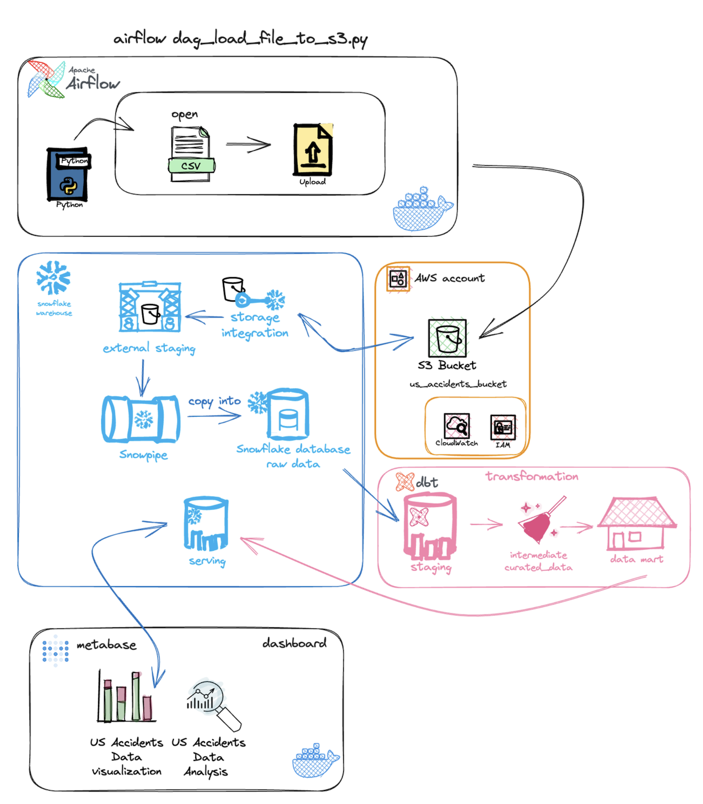
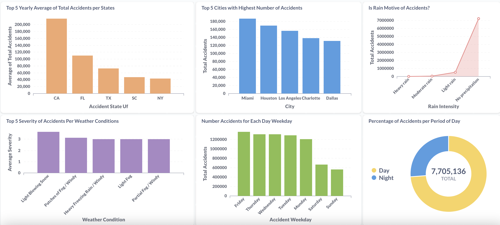

# USA ROAD ACCIDENTS ETL PROJECT 


### 1. DATA ARCHITECTURE



### 2. PROJECT
- This is a ETL Project based on a Kaggle dataset called [US Accidents 2016 - 2023](https://www.kaggle.com/datasets/sobhanmoosavi/us-accidents) 

##### 2.1 DATASET DESCRIPTION 
This is a countrywide traffic accident dataset, which covers 49 states of the United States. The data was collected from February 2016 to March 2023, using several data providers, including multiple APIs that provide streaming traffic event data. These APIs broadcast traffic events captured by a variety of entities, such as the US and state departments of transportation, law enforcement agencies, traffic cameras, and traffic sensors within the road-networks. Currently, there are almost 8 million accident records in this dataset.

### 3. SOLUTION

##### 3.1 AIRFLOW PIPELINE 
<p> First of all I created a python script to upload the 3GB csv file to my Amazon S3 bucket </p>
<b> Created the function: </b>

``` upload_csv_file_to_s3() ``` 

- <p>To send the csv file to S3 using boto3 AWS SDK for python, I'm not completely sure of it is the right or the best approach, I configured the credentials in the dockerfile and used os package to protect the cloud credentials mantaining on virtual environment and then putting the object</p>
- <p>Created my S3 bucket and the necessary roles and policies in IAM.</p>
- <p>Then I runned Airflow in Docker using docker-compose file, procedure just as the airflow tutorial recommends for learning and exploration environments.</p>
<b>Created my dag: </b>

``` dag_load_file_to_s3 ``` 

<p> - To orquestrate this simple process of ingestion. </p>

 ##### 3.2 SNOWFLAKE
 <p> Created a free account in Snowflake to exploration, my option was the Enterprise because it have more resources. </p> 
 
  - <p>You can see the snowflake process steps in the:
  [snowflake directory](./snowflake/steps/)</p>
  
  - <b>STEP 1. STORAGE INTEGRATION</b>
    - <p>Created a storage integration between snowflake and S3. It's necessary to create IAM role and policy in AWS to it</p>
  - <b>STEP 2. FILE FORMAT</b>
    - <p>Created a csv file format, because the default file format wasn't enough</p>
  - <b>STEP 3. EXTERNAL STAGE</b>
    - <p>Creating an External Stage allows you to easily access and manage data stored in an external storage service, in my case, Amazon S3.</p>
  - <b>STEP 4. DATABASE, SCHEMA AND TABLE RAW</b>
    - <p>It is necessary to create the entire context for the raw table that will be used to receive the data from the CSV.</p>
  - <b>STEP 5. SNOWPIPE</b>
    - <p>Snowpipe is a service in Snowflake that enables continuous and automatic data ingestion, simplifying the process by eliminating the need for manual tasks or complex scripts. It ensures that data is loaded automatically into Snowflake as soon as it becomes available in the source location. During the ingestion, I used only the Medium Warehouse to ingest nearly 8 million lines from the 3GB file.</p>

##### 3.3 DBT 
  - <p> Created a free account in dbt and linked it to Snowflake. I utilized the dbt cloud and tried to follow best practices according to the dbt manifesto</p>
  - <p>Created three stages: </p>
  - <p> <b> Staging: </b> The goal of staging is to prepare the data for subsequent transformation and loading steps.</p>
  - <p> <b> Intermediate: </b>  Involves transforming the data into a more refined form, often including cleaning, aggregation, filtering, and other manipulations. In this step, the data is structured and prepared for further analysis or data model creation </p>
  - <p> <b>  Marts: </b> These are datasets ready for analysis, optimized for efficient querying and visualization. </p>
  - <p> Executed dbt build, and these transformations were returned to Snowflake ready for analysis.</p>

##### 3.4 METABASE 
- <p> Created a free account in metabase and linked it to Snowflake. I utilized the metabase on-prem and runned inside a docker container</p>
- <p>You can see the config used in the:
[metabase directory](./metabase-config/metabase-config.txt)
  </p>
- I answered some questions with analysis and created this dashboard: 
  


  
### 4. TECH STACK 
- Python
- Docker
- Airflow Orchestrator 
- Snowflake Datawarehouse:
  - Snowpipe
  - External stage
  - Storage Integration 
- AWS: 
   - S3
   - CloudWatch
   - IAM
- dbt
- Metabase 


### 5. REFERENCES AND ACKNOWLEDGMENTS

<p> 
  Moosavi, Sobhan, Mohammad Hossein Samavatian, Srinivasan Parthasarathy, and Rajiv Ramnath.       
  
  [“A Countrywide Traffic Accident Dataset.”](https://arxiv.org/abs/1906.05409) , arXiv preprint arXiv:1906.05409 (2019). </p>

  Moosavi, Sobhan, Mohammad Hossein Samavatian, Srinivasan Parthasarathy, Radu Teodorescu, and Rajiv Ramnath. [“Accident Risk Prediction based on Heterogeneous Sparse Data: New Dataset and Insights.”](https://arxiv.org/abs/1909.09638) In proceedings of the 27th ACM SIGSPATIAL International Conference on Advances in Geographic Information Systems, ACM, 2019.
</p>
